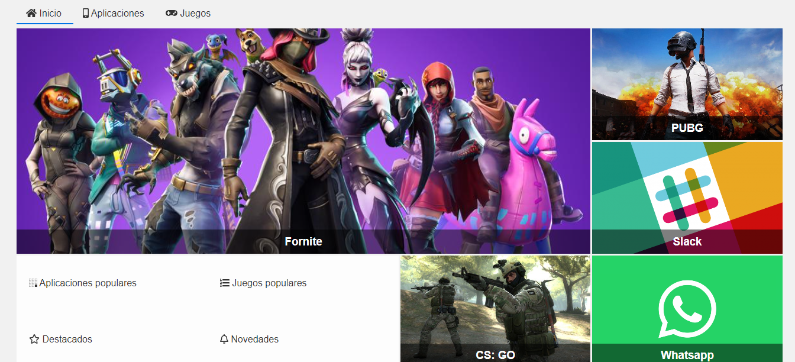

# Alura Store

Alura Store es una plataforma donde encontrara las aplicaciones y juegos mas populares del mercado.

¡Puede visitar la pagina web de Alura Store y ver los cientos de aplicaciones y juegos que le ofrece!

Visite Alura Store siguiendo este [link](https://nancycima.github.io/AluraStore/)

### Desarrollo

Los archivos iniciales del proyecto, como el prototipo y las imagenes, corresponden al curso "CSS Grid Layouts", de Alura LATAM.

Posteriormente, se trabajo sobre la pagina hasta llegar a lo pedido y, ademas, se le hicieron las modificaciones que parecieran adecuadas.

### Contenido
En este repositorio encontrara:
  - "Un archivo PDF que contiene el diseño a seguir para la pagina web"
  - "Un archivo HTML llamado "index.html" que contiene la estructura de la página"
  - "Una carpeta "assets" que contiene:
        - una carpeta "css" que incluye un conjunto de hojas de estilo CSS correspondientes al diseño de la página,
        - una carpeta "img" con las imagenes e iconos usados en la página,
        - y, una carpeta "js" que contiene un archivo para la utilizacion de la libreria de iconos "Font Awesome".

### Contacto
Si este proyecto le intereso y quiere saber más o si vio mi portfolio y le gustaria contactarme, puede hacerlo enviando un mail a:
- nancy.cima.bertoni@hotmail.com

